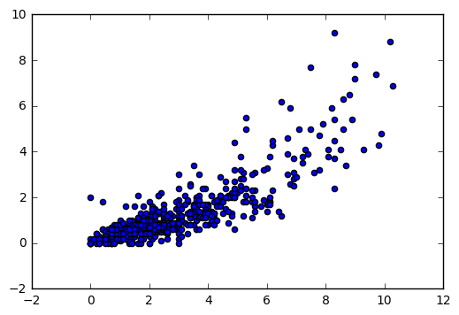

# NBA Analytics With Python

Gene Li  
B.S.E Electrical Engineering  
Princeton University, '19  
September 1, 2017  

## Introduction

This guide was written for students in the [Princeton Sports Analytics](https://princetonsportsanalytics.com/) club. Students just getting into the world of sports analytics have a lot of questions, and this guide will serve as a starting point for understanding the big picture overview of the data science process for getting data, processing it, visualizing it, and applying interesting learning models to it.

While this guide was originally written for NBA analytics in mind, it is a good resource for other areas of sport analysis.

Any questions, comments, or suggestions can be directed toward the author at gxli@princeton.edu.

### 1. What are we even doing?

Data science, broadly speaking, is the field that uses the scientific method to extract novel insights from data sets. Machine learning, a subset of data science, uses data to generate interesting predictions, classifications, and decisions. While certain [figures](https://www.youtube.com/watch?v=NZf9NFaCQHQ) remain staunchly opposed to the use of analytics in the NBA, for the most part, the NBA is embracing the use of analytics and machine learning. For example, a company called [Second Spectrum](https://www.secondspectrum.com/). Second Spectrum is using deep learning models to measure shot efficiency and classify pick-and-roll defensive schemes. I recommend [this ted talk](https://www.ted.com/talks/rajiv_maheswaran_the_math_behind_basketball_s_wildest_moves).

The main tool we will use in data science is the programming language Python. While data scientists use a broad range of tools, ranging from Excel, MATLAB, Python, and R, Python offers a few key advantages, namely being very flexible and easy to learn. For more information about Python, please to the Python [website](http://kevindurant.com/).

Wrong link, go [here](https://www.python.org/) instead.

Python also has the benefit of allowing users to use "IPython notebooks" - think of these as the programming equivalent of lab notebooks you would use in a traditional science class. These notebooks can be shared with others, and it's easy to view and modify the steps that are performed in the data science process. In fact, this guide is an IPython notebook. More information about IPython notebooks can be found [here](https://ipython.org/notebook.html).

Python's main library for data science is the pandas library - which provides high performance functionality and data science tools for Python. pandas helps bridge the gap from data preparation to data analysis and modeling. pandas functionality can be imported as easily as this one-liner:


```python
import pandas
```

Documentation on pandas can be found [here](https://pandas.pydata.org/pandas-docs/stable/).

### 2. Take that for Data

At this point, you may have some fuzzy question that you want to have answered, i.e. how do we measure defensive ability? Don't be worried if this question isn't exact - you will have many opportunities to refine it as you go along. Just trust the process here.

The first step is to get as much quality NBA data as you can. The bigger the data, the better. This is not as easy as it sounds. You'll almost never find clean, processed data in the wild. Often times, you'll have to scrape it from different reference sources.

The best possible scenario is that the NBA has a public, well documented API for getting as much data as you could possibly need. Unfortunately, they don't, so we will have to settle for grit n' grind methods. Generally, you will need to query a stats.nba.com or basketball-reference.com endpoint with some parameters, and you'll get a JSON back with data. Unfortunately, the REST APIs for stats.nba.com and basketball-reference hav no documentation, so it's up to the user to figure out 1) what endpoints to query, 2) what sort of parameters these endpoints take, 3) what the resulting data looks like. 

1) Using various APIs for stats.nba.com and basketball reference: A variety of python-facing APIs exist for querying stats.nba.com and basketball-reference.com. A quick google search will give you a few options. Since many of these APIs are not in a mature development stage, I will not devote much time to them. However, the aspiring NBA data scraper may find them useful. 

2) Someone on the internet put together a nice Swagger UI that documents a large portion of the endpoints of stats.nba.com API [here](http://danielwelch.github.io/little-pynny/). Documentation can be found [here](http://danielwelch.github.io/documenting-the-nba-stats-api.html). The issue with this is that even though the endpoints and parameters are documented, we still don't know exactly what the endpoints give us and what type of values for the parameters we need to provide. Let's try to get some player statistics.


```python
import requests
import pandas as pd
import os
```


```python
# we will be making a request to the NBA API, so we have to pretend we are a browser by setting this user agent header.
user_agent_headers = {'user-agent':
    'Mozilla/5.0 (Macintosh; Intel Mac OS X 10_12_1) AppleWebKit/537.36 (KHTML, like Gecko) Chrome/55.0.2883.95 Safari/537.36'}

# this is the base url for player statistics.
baseURL_playerstat = 'http://stats.nba.com/stats/leaguedashplayerstats?'


# we also need some parameters.
parameters_playerstat = {
            'College': '',
            'Conference': '',
            'Country': '',
            'DateFrom': '',
            'DateTo': '',
            'Division': '',
            'DraftPick': '',
            'DraftYear': '',
            'GameScope': '',
            'GameSegment': '',
            'Height': '',
            'LastNGames': 0,
            'LeagueID': '00',
            'Location': '',
            'MeasureType': 'Base',
            'Month': 0,
            'OpponentTeamID': 0,
            'Outcome': '',
            'PORound': 0,
            'PaceAdjust': 'N',
            'PerMode': 'PerGame',
            'Period': 0,
            'PlayerExperience': '',
            'PlayerPosition': '',
            'PlusMinus': 'N',
            'Rank': 'N',
            'Season': '2016-17',
            'SeasonSegment': '',
            'SeasonType': 'Regular Season',
            'ShotClockRange': '',
            'StarterBench': '',
            'TeamID': 0,
            'VsConference': '',
            'VsDivision': '',
            'Weight': '',
        }
```


```python
# returns dataframe given base url, parameters.
def scrapeURL(baseURL, parameters):
    response = requests.get(baseURL, params=parameters, headers=user_agent_headers)
    response.raise_for_status()
    headers = response.json()['resultSets'][0]['headers']
    stats = response.json()['resultSets'][0]['rowSet']
    stats_df = pd.DataFrame(stats, columns=headers)
    stats_df['Season'] = parameters['Season']
    stats_df.drop(['CFID', 'CFPARAMS'], axis=1, inplace=True)
    return stats_df
```


```python
df = scrapeURL(baseURL_playerstat, parameters_playerstat)
df.head() # D A T A 
```


<div>
<table border="1" class="dataframe">
  <thead>
    <tr style="text-align: right;">
      <th></th>
      <th>PLAYER_ID</th>
      <th>PLAYER_NAME</th>
      <th>TEAM_ID</th>
      <th>TEAM_ABBREVIATION</th>
      <th>AGE</th>
      <th>GP</th>
      <th>W</th>
      <th>L</th>
      <th>W_PCT</th>
      <th>MIN</th>
      <th>...</th>
      <th>STL_RANK</th>
      <th>BLK_RANK</th>
      <th>BLKA_RANK</th>
      <th>PF_RANK</th>
      <th>PFD_RANK</th>
      <th>PTS_RANK</th>
      <th>PLUS_MINUS_RANK</th>
      <th>DD2_RANK</th>
      <th>TD3_RANK</th>
      <th>Season</th>
    </tr>
  </thead>
  <tbody>
    <tr>
      <th>0</th>
      <td>1627773</td>
      <td>AJ Hammons</td>
      <td>1610612742</td>
      <td>DAL</td>
      <td>24.0</td>
      <td>22</td>
      <td>4</td>
      <td>18</td>
      <td>0.182</td>
      <td>7.4</td>
      <td>...</td>
      <td>463</td>
      <td>93</td>
      <td>329</td>
      <td>401</td>
      <td>397</td>
      <td>439</td>
      <td>219</td>
      <td>222</td>
      <td>24</td>
      <td>2016-17</td>
    </tr>
    <tr>
      <th>1</th>
      <td>201166</td>
      <td>Aaron Brooks</td>
      <td>1610612754</td>
      <td>IND</td>
      <td>32.0</td>
      <td>65</td>
      <td>36</td>
      <td>29</td>
      <td>0.554</td>
      <td>13.7</td>
      <td>...</td>
      <td>345</td>
      <td>345</td>
      <td>341</td>
      <td>311</td>
      <td>336</td>
      <td>331</td>
      <td>248</td>
      <td>222</td>
      <td>24</td>
      <td>2016-17</td>
    </tr>
    <tr>
      <th>2</th>
      <td>203932</td>
      <td>Aaron Gordon</td>
      <td>1610612753</td>
      <td>ORL</td>
      <td>21.0</td>
      <td>80</td>
      <td>29</td>
      <td>51</td>
      <td>0.363</td>
      <td>28.7</td>
      <td>...</td>
      <td>136</td>
      <td>123</td>
      <td>112</td>
      <td>135</td>
      <td>116</td>
      <td>101</td>
      <td>361</td>
      <td>80</td>
      <td>24</td>
      <td>2016-17</td>
    </tr>
    <tr>
      <th>3</th>
      <td>1626151</td>
      <td>Aaron Harrison</td>
      <td>1610612766</td>
      <td>CHA</td>
      <td>22.0</td>
      <td>5</td>
      <td>2</td>
      <td>3</td>
      <td>0.400</td>
      <td>3.3</td>
      <td>...</td>
      <td>481</td>
      <td>471</td>
      <td>474</td>
      <td>463</td>
      <td>462</td>
      <td>482</td>
      <td>289</td>
      <td>222</td>
      <td>24</td>
      <td>2016-17</td>
    </tr>
    <tr>
      <th>4</th>
      <td>203940</td>
      <td>Adreian Payne</td>
      <td>1610612750</td>
      <td>MIN</td>
      <td>26.0</td>
      <td>18</td>
      <td>5</td>
      <td>13</td>
      <td>0.278</td>
      <td>7.5</td>
      <td>...</td>
      <td>310</td>
      <td>176</td>
      <td>445</td>
      <td>219</td>
      <td>368</td>
      <td>379</td>
      <td>154</td>
      <td>222</td>
      <td>24</td>
      <td>2016-17</td>
    </tr>
  </tbody>
</table>
<p>5 rows × 62 columns</p>
</div>


3) Manually getting endpoint by inspecting the URL:

This is probably a more clear way to get API endpoints, rather than looking at the Swagger documentation. If you find a new endpoint you want to send a request to, you'll need to do some snooping around. 

For example, lets see what we can do with this web page. http://stats.nba.com/players/traditional/
Imagine we want to get all the data from this page. 
We will need to see what requests are being made to the NBA server. To do so, we will need to bring up Developer Tools in Chrome, navigate to XHR, and refresh the page. You should get something similar to this:


Now look at the third entry, called "leaguedashplayerstats?". That looks promising. If we click on it, we'll get something like this:


Parameters are the input parameters to the HTTP request that is sent whenever we load the page. The result set is the actual data returned. Take a look at these. If you want to see the whole JSON file that is returned, go to the "Headers" tab in the window above and copy paste the request URL into your browser. You may want to use some browser extension that formats JSON.

By snooping around using developer tools, you can basically figure out how to scrape any web page that is making API calls to some backend server. 

4) Haven't really looked into this, but perhaps the scraping process can be automated with a framework like [Scrapy](https://scrapy.org/).

5) SportVU is a camera system that is installed in all NBA stadiums that provides player and ball position data at a resolution of 25 frames per second. For the serious NBA analytics guru, this is probably the best basketball analytics data you can get. The NBA used to provide this data on their website, however, they took it down. Parts of it have been floating around on the [internet](https://github.com/sealneaward/nba-movement-data).

### 3. Data Preprocessing

We can't really do much with a bunch of JSON files. We should convert these into CSV files. If we truly do have a lot of data, perhaps we should put all the data in a relational database.

In python, this is as easy as calling the to_csv method of pandas:


```python
df.to_csv('sampledata.csv', header=df.columns.values, index=False)
```

### 4. Data Visualization

A few options for data visualization exist. The most widely used one is [matplotlib](https://matplotlib.org/), which for those who are familiar with MATLAB, provides similar plotting functionality. On top of that, you have [seaborn](https://seaborn.pydata.org/), which is a high level interface that makes matplotlib graphs more pretty. A third option is [plotly](https://plot.ly/), another graphing library.
Let's try plotting something in matplotlib.


```python
import matplotlib.pyplot as plt
```


```python
# plot field goals made against free throws made
plt.scatter(df['FGM'], df['FTM'])
plt.show()
```





### 5. Data Science

Now we want to do fun stuff with our data: regressions, clusterings, perhaps more advanced machine learning. For sake of brevity, I will omit an introduction to machine learning, however I do recommend the reader familiarize themselves with statistics and machine learning through coursework, books, and online tutorials.

1) [scikit-learn](http://scikit-learn.org/stable/): The main package for machine learning in python.  
2) Deep learning: Keras, TensorFlow, Theano. These are packages for building more advanced deep learning
